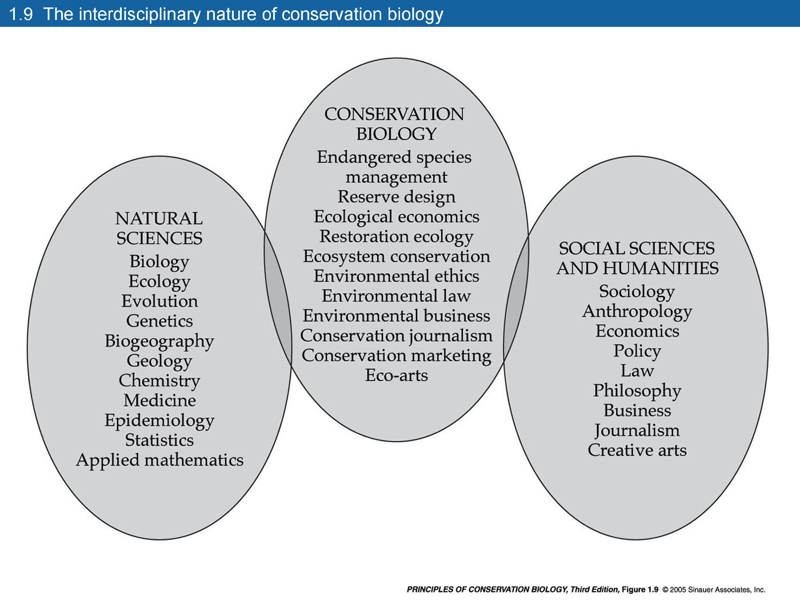

```{r setup, include=FALSE}
library(tidyverse)
library(knitr)
knitr::opts_chunk$set(echo = TRUE)
```

```{r xaringan-tile-view, echo=FALSE}
xaringanExtra::use_tile_view()
xaringanExtra::use_share_again()
xaringanExtra::use_scribble()
xaringanExtra::use_fit_screen()
```

# O que precisamos saber hoje?
.pull-left[
### - O que é a biologia da conservação

### - História (resumida) do pensamento conservacionista

### - A atualidade do pensamento conservacionsita

### - Agendas políticas de conservação da biodiversidade
]

.pull-right[
<br>
[Primack and Sher 2016](https://www.amazon.com.br/Introduction-Conservation-Biology-Richard-Primack/dp/1605354732)
]

---
.center[
# O que é a biologia da conservação?

 ]

---
# Algumas características
.pull-left[
###- Multidisciplinaridade

###- Surge em resposta à crise de extinção (crisis discipline)

###- Ciência inexata

###- Objetivos claros: RESOLVER A CRISE DA BIODIVERSIDADE
]
.pull-right[

]

---
# A fundação da sociedade para a biologia da conservação - SCB
.pull-left[
## - Michael Soulé

[Uma biografia em PT aqui](https://www.oeco.org.br/colunas/nerd-budista-pai-da-biologia-da-conservacao-a-vida-maravilhosa-de-michael-soule/)]
.pull-right[
###- Biólogo, professor de ecologia de populações, Univ Stanford, EUA

###- Fundador da SCB em 1985

###- Definou os fundamentos da BC
  - Extinções causadas pelo homem são indesejáveis
  - Simplificação dos ecossistemas causada pelo homem, é igualmente indesejável
  - A evolução é desejável e deve continuar
  - A Biodiversidade tem valor intrínseco
]

---
# O pensamento conservacionista na história da humanidade
.pull-left[
###- Reservas de caça e pesca para Reis e nobres
###- Santuários cênicos
###- Mitos religiosos
###- Zoneamento e planejamento territorial
]
.pull-right[

[Parque Nacional Hakusan](https://en.wikipedia.org/wiki/Hakusan_National_Park)
]

---
# Monte Roraima
.pull-left[

]
.pull-right[
###- Lugar sagrado para muitas tribos da região (Arekuná, Makuxi, Wapichana e Ingariko)
###- Um heroi criador e destruidor
###- Ajuda a entender a cosmogonia da região
]

---
# Calakmul, México
<iframe width="1195" height="672" src="https://www.youtube.com/embed/3oVeckqW1SQ" title="YouTube video player" frameborder="0" allow="accelerometer; autoplay; clipboard-write; encrypted-media; gyroscope; picture-in-picture" allowfullscreen></iframe>

---
# Uma história bem documentada nos EUA
.pull-left[
### Henry David Thoreau (1817-62)
#### Apologista da natureza como preservação da natureza humana

]
--
.pull-right[
### John Muir
#### O primeiro “naturalista” dos EUA. Responsável pela criação do Yosemite National Park.

[Famoso por seus comentarios racistas](https://www.theguardian.com/environment/2020/jul/23/john-muir-sierra-club-apologizes-for-racist-views)
]

---
# E no Brasil?

# Marechal Cândido Rondon (1865-1958)
#### Conservacionismo nacionalista
#### Proteção ao Índio
#### _**"Eu Creio: Que o homem e o mundo são governados por leis naturais.”**_


---
# Conseqüências do pensamento ambientalista precoce dos EUA
.pull-left[
### Sistema nacional de parques dos EUA (1872)
### Sistema nacional de parques Canadá (1885)
### Sociedade Civil Organizada (embriões de ONGs)
  -Ducks Unlimitted
  
  -Wilderness Society
  
  -Audubon Society
]
.pull-right[
]

---
# O primeiro Parque Nacional do Brasil

.pull-left[
<a title="Gabrielrvallim, CC BY-SA 3.0 &lt;https://creativecommons.org/licenses/by-sa/3.0&gt;, via Wikimedia Commons" href="https://commons.wikimedia.org/wiki/File:Parque_Nacional_de_Itatiaia_(19).jpg"></a>
<a href="https://commons.wikimedia.org/wiki/File:Parque_Nacional_de_Itatiaia_(19).jpg">Gabrielrvallim</a>, <a href="https://creativecommons.org/licenses/by-sa/3.0">CC BY-SA 3.0</a>, via Wikimedia Commons]
.pull-right[
###I Conferência Brasileira de Proteção à Natureza
  - Sociedade Brasileira de Amigos das Árvores
  - Rio de Janeiro – abril de 1934
  - Identidade Nacional
  - Ética Ambiental 
  - Proteção de Recursos Florestais

####Getíluo Vargas – 1937 Decreta o PN Itatiaia
]

---
# Pensamento Conservacionista no Brasil
.pull-left[
###Irmãos Villas-Bôas
####Criação do Parque Nacional do Xingú
####Expedições científicas pelo Brasil Central

]

.pull-right[

]

---
# Pensamento Conservacionista no Brasil

.pull-left[
## Chico Mendes

]
.pull-right[
###- Sindicalista
###- Ativista Ambiental
###- Ajudou a criar a primeira RESEX do Brasil
###- Assasinado numa emboscada

### Veja esse excelente [documentário](https://www.youtube.com/watch?v=7FimsUcz-Y4)
]

---
# Pensamento Conservacionista no Brasil
### Onde estão as mulheres?
.pull-left[
### Marina Silva
<a title="Marina Silva from Brasil, CC BY 2.0 &lt;https://creativecommons.org/licenses/by/2.0&gt;, via Wikimedia Commons" href="https://commons.wikimedia.org/wiki/File:Marina_na_milit%C3%A2ncia_Acre_(1994)_(4538981710).jpg"></a><br>
<a href="https://commons.wikimedia.org/wiki/File:Marina_na_milit%C3%A2ncia_Acre_(1994)_(4538981710).jpg">Marina Silva from Brasil</a>, <a href="https://creativecommons.org/licenses/by/2.0">CC BY 2.0</a>, via Wikimedia Commons]

.pull-right[

### Histórias de mulheres no ambientalismo
###- [#BLACKINNATURE E A SEMANA DO MEIO AMBIENTE](https://mulheresnaciencia.com.br/blackinnature-e-a-semana-do-meio-ambiente/)
###- [Como o feminismo se relaciona com a pauta ambiental](https://www.nexojornal.com.br/entrevista/2019/09/20/Como-o-feminismo-se-relaciona-com-a-pauta-ambiental)
###- [Luta ambiental feminina](https://www.oeco.org.br/colunas/24371-mulheres-no-meio-ambiente-da-america-latina/)
]

---
# Como o Brasil se posicionava na Geopolítica Ambiental?
.pull-left[
### Historicamente fomos liderança na agenda ambiental
### Sediamos duas conferências da ONU 1992 e 2012
### Influencimaos o conceito de unidades de conservaçaõ no mundo
### Mas sempre foomo muuuito incompetentes em resolver probelmas internos
]
.pull-right[


]
---
# Como se posiciona hoje?

.pull-left[
<br>
[Em reunião com EUA, Salles mostra Brasil como cachorro de olho em frango de padaria(https://www1.folha.uol.com.br/ambiente/2021/04/em-reuniao-com-eua-salles-mostra-brasil-como-cachorro-de-olho-em-frango-de-padaria.shtml)]]

.pull-right[

]

---
#Sistema Nacional de Unidades de Conservação - SNUC
.center[


###[O que é o SNUC](https://www.oeco.org.br/dicionario-ambiental/28223-o-que-e-o-snuc/)
###[Escute esse podcast também](https://biologiadaconservacao.com.br/papagaiodeprimata-ep6)
]

---
class: center
# Biologia da Conservação é uma disciplina que procura entender, quantificar e solucionar a crise da biodiversidade


---
# De espécies à sistemas

### Houve uma grande mudança de discruso da conservação nas últimas décadas

### - Conservacionismo

### - Neoconservacionismo

### - Conservação convivial

---
# Movimento Conservacionista
.pull-left[
<a title="Unknown authorUnknown author, Public domain, via Wikimedia Commons" href="https://commons.wikimedia.org/wiki/File:Sir_William_Schlich07.jpg"></a<a href="https://commons.wikimedia.org/wiki/File:Sir_William_Schlich07.jpg">Unknown authorUnknown author</a>, Public domain, via Wikimedia Commons>
]
.pull-right[
### ligado às origens coloniais e elististas
### visão romântica e despolitizadora da natureza
### Proteção de áreas e espécies como principal bandeira
]

---
# O Conservacionismo e a capitalização da natureza
.pull-left[
###[Peter Kareiva](https://www.ioes.ucla.edu/person/peter-kareiva/)

]

.pull-right[
### - Valoração econômica e não econômica da Natureza
### - Natureza como um capital global, que flui
### - Noções de sustentabilidade e serviços ecossistêmicos
## - Trabalha dentro do capitalismo, não na sua superação
###[Natural Capital Project](https://naturalcapitalproject.stanford.edu/)
]

---
# Neoconservacionismo

### Radicalização do dualismo Humano-Natureza
### Negação do "Antropoceno"
### Almeja conservar 50% da Terra
### Resgata valores intrínsecos do conservacionismo clássico
##[Half-earth Project](https://www.half-earthproject.org/)

---
# Half-earth
<iframe width="1280" height="520" src="https://www.youtube.com/embed/6fGJafDDCks" title="YouTube video player" frameborder="0" allow="accelerometer; autoplay; clipboard-write; encrypted-media; gyroscope; picture-in-picture" allowfullscreen></iframe>

---
# Conservação convivial
.pull-left[

]
.pull-right[
### Baseado na comprensão política da conservação
### Anticapitalista
### Decrescimento econômico
### Convivência entre plantas, humanos e animais

]

---
# Conservação convivial
<iframe width="1280" height="520" src="https://www.youtube.com/embed/fI_IYLHv96o" title="YouTube video player" frameborder="0" allow="accelerometer; autoplay; clipboard-write; encrypted-media; gyroscope; picture-in-picture" allowfullscreen></iframe>

---
class: center, middle
#FIM
