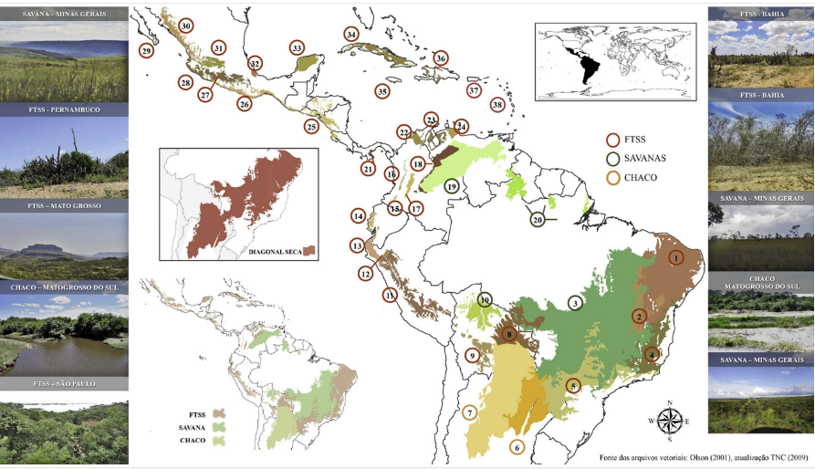
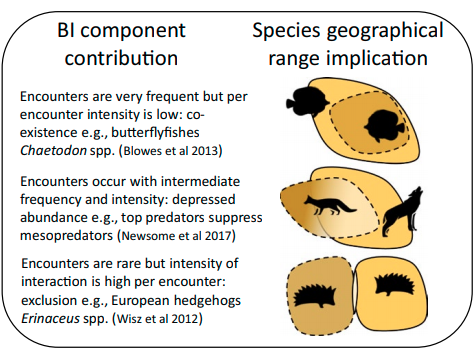
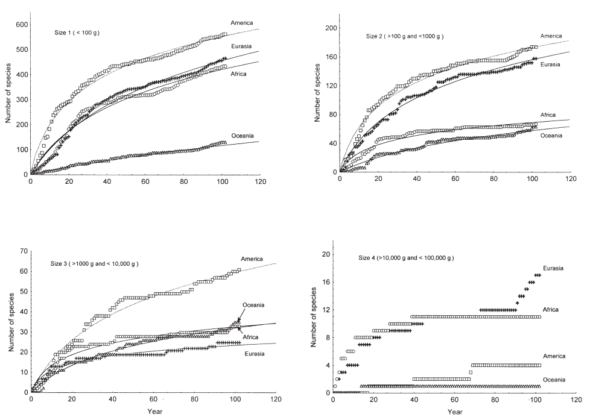

```{r setup, include=FALSE}
library(tidyverse)
library(knitr)
knitr::opts_chunk$set(echo = TRUE)
```

```{r xaringan-tile-view, echo=FALSE}
xaringanExtra::use_tile_view()
xaringanExtra::use_scribble()
xaringanExtra::use_fit_screen()
```

# O que precisamos saber hoje?

.pull-left[
- ### Como a biodiversidade se organiza espacial e temporalmente na Terra
- ### Como usar essas informações para desenhar estratégias de conservação
- ### Aprender um pouco de Biogeografia
]

.pull-right[

]
---

# A história da biodiversidade


---
# Vivemos o período mais Biodiverso da Terra
.pull-left[


]
.pull-right[
### Mas não foi suave...
### Houve muitas extinções EM MASSA
### Mas a vida continuou prosperando
]
---
class: center, middle
# A vida na Terra hoje é o resultado de 4,5 bilhões de anos de evolução, especiação, extinção e dispersão
---
# Fronteiras biológicas da Terra
[**Províncias biogeográficas**](https://en.wikipedia.org/wiki/Biogeographic_realm)

---
# A bidiversidade se desenvolveu em diferentes lugares
### na terra (plantas)

---
# A bidiversidade se desenvolveu em diferentes lugares
### no mar [(mamíferos)](https://journals.plos.org/plosone/article?id=10.1371/journal.pone.0019653)


---
# A própria árvore da vida é bastante desigual em termos de diversidade

---
# Padrões e mais padrões
.pull-left[

[Purvis & Hector¨ (2000).](https://www.nature.com/articles/35012221)
]

.pull-right[
- ### Esse padrão aninhado acontece em todos os níveis de vida

]
---
class: center, middle

# E continua...
---
# Qual o nosso nível de conhecimento sobre a biodiversidade entre clados?
.pull-left[

[Purvis & Hector¨ (2000).](https://www.nature.com/articles/35012221)
]
.pull-right[

]

---
# Alfred Russell Wallace
.pull-left[
]

.pull-right[

- ### Considerado o fundador da Biogeografia

Estava bastante interessado na distribuição das espécies em ilhas do Sul da Asia

#### [Leitura recomnedada: Darwin, historical biogeography, and the importance of overcoming binary opposites](https://onlinelibrary.wiley.com/doi/full/10.1111/j.1365-2699.2009.02111.x)
]
---
# Princípios da Biogeografia aplicados ao entedimento da Biodiversidade
.pull-left[
- ### Relação espécie-área
- ### Nicho ecológico
- ### Ecologia vs. História
- ### Interação entre espécies
]

.pull-right[
]
---
# Relação espécie-área
- ### O número de espécies aumenta com a área amostrada
.pull-left[
### Linear
```{r echo=FALSE, out.width="70%"}
spe_area<-tibble(area=10:1000,
       spe_lin=area/3) 
spe_area%>% 
  ggplot(aes(x=area,y=spe_lin))+geom_point()
```
https://en.wikipedia.org/wiki/Species%E2%80%93area_relationship
]

.pull-right[
### Exponencial
```{r echo=FALSE, out.width="70%"}
spe_area_exp<-tibble(area=10:1000,
       spe_exp=((area*100000)^0.1)) 
spe_area_exp%>% 
  ggplot(aes(x=area,y=spe_exp))+geom_point()
```
]
---
# Nicho ecológico ou biogeografia ecológica
.center[
]
---
# Biogeografia Histórica
.center[


https://www.scielo.br/scielo.php?script=sci_arttext&pid=S2175-78602018000402209]

---
# Interação entre espécies
.center[

]
---
# Biogeografia de ilhas
.pull-left[

[Biogeografia de ilhas em PT-BR](http://recologia.com.br/2016/06/09/biogeografia-de-ilhas/)]

.pull-right[


[Biogeografia de Ilhas no Wikipedia](https://en.wikipedia.org/wiki/Insular_biogeography)]

---
# Tipos de raridade
.center[

]

[Rabinowitz’s (1981)](https://www.esf.edu/efb/parry/Invert_Cons_14_Readings/Rabinowitz_1981.pdf)
---
# Aplicações na conservação da biodiversidade
.pull-left[

]
.pull-right[
A = Riqueza

B = Endemismo

C = Novas espécies

Atenção para as cores vermelhas, que mostram onde espećies novas de mamíferos foram descobertas fora de **Hotspots**


[Discoveries of new mammal species and their implications for conservation and ecosystem services](https://www.pnas.org/content/106/10/3841)]
---
# Aplicações na conservação da biodiversidade
.pull-left[

[Medellín & Soberon 2008](https://conbio.onlinelibrary.wiley.com/doi/abs/10.1046/j.1523-1739.1999.97315.x)
]
--
.pull-right[
]
---
# Aplicações na conservação da biodiversidade
.center[´
]
[Brooks et al 2006](https://science.sciencemag.org/content/313/5783/58)
---
class: center, middle
# FIM


